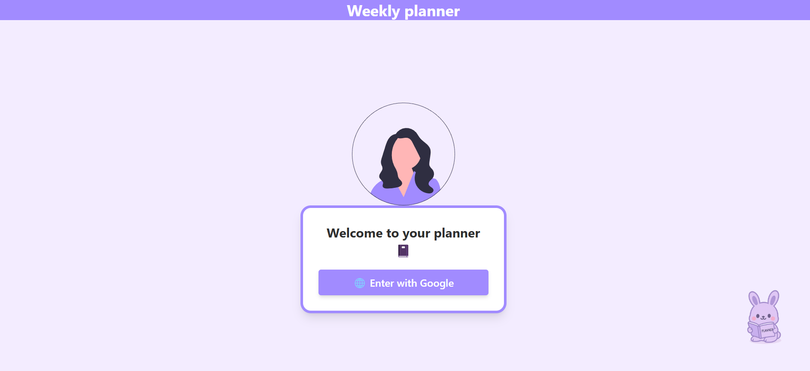
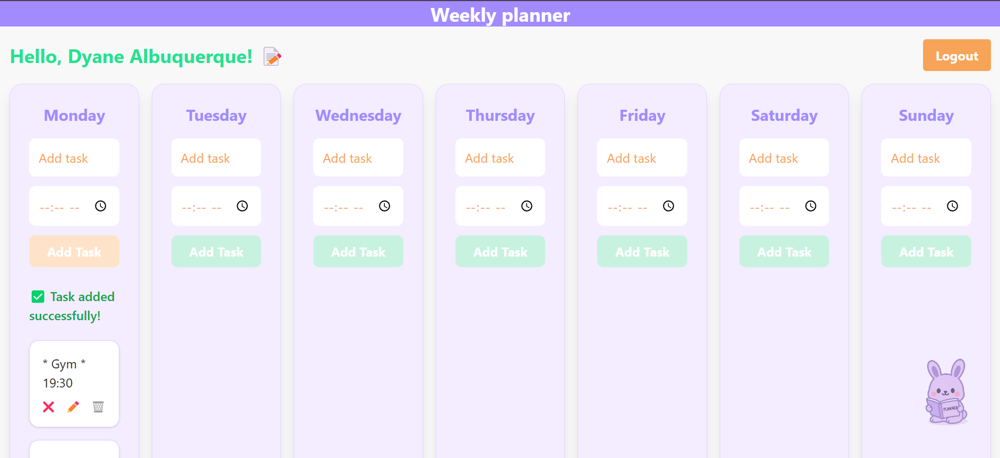

# Weekly planner





Simple weekly planner app that helps users organize their tasks by day.
The app allows users to add, edit and save edited tasks, mark as done, and delete tasks - all saved with Firebase.  
Users can log in with their google account to securely access their planner.

This is a test project that uses an external API. **The API key is temporarily exposed** for testing and demonstration purposes. 
**IMPORTANT**: Never expose your API keys in production or public projects, as this can compromise the security of your application.

**Features:**
- Google login to securely access your tasks
- Add tasks with or without a time 
- Edit ot delete tasks 
- Mark tasks as done or not done
- Google login authentication
- Data stored in Firebase
- UI with animations and cute mascot

**Technologies:**
- React
- Firebase (Auth and Firestore)
- Tailwind CSS
- Framer Motion

## How to run weekly planner

Follow the steps:

- **Node.js**: A JavaScript runtime that is required to run the app. [Download Node.js](https://nodejs.org/)
- Clone the repository
   ```bash
   git clone https://github.com/PrinDyane/weekly-planner
- Access repository-name
    ```bash
   cd planner--
- Install dependencies 
    ```bash
   npm install 
- Run app 
    ```bash
    npm run dev   
Made with 💜 by Dyane Albuquerque 
